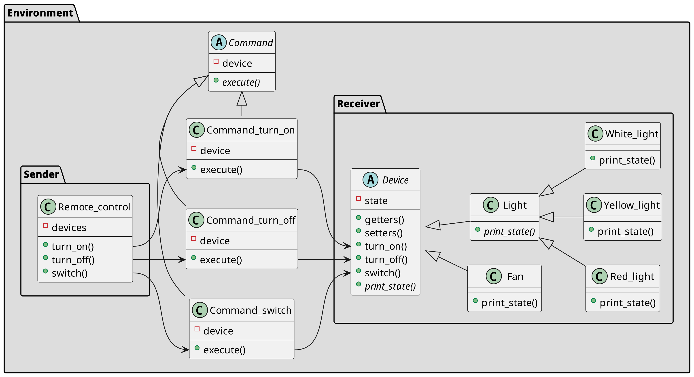

# COMMAND PATTERN

## Usage

Used as an alternative for *callbacks* to parameter UI elements with actions, queue tasks,
track operation history, etc.

> - Behavioral methods in abstract/interface type(*Sender*).
> - Senders invokes a method from another different abstract/interface type(*Receiver*) which
has been encapsulated by a command.
> - Command classes are usually limited to specific actions.

## Class Diagram

