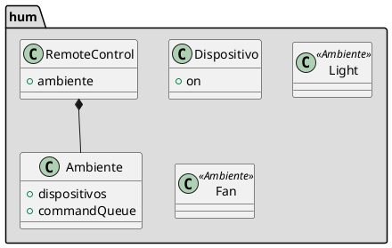

### uml: class diagram

```plantuml
@startuml
package "hum" #DDDDDD {
    class Dispositivo {
        + on
    }

    class Light <<Ambiente>>
    class Fan <<Ambiente>>

    class Ambiente {
        + dispositivos
				+ commandQueue
    }

    class RemoteControl {
        + ambiente
    }

   	RemoteControl *-- Ambiente
}
@enduml
```